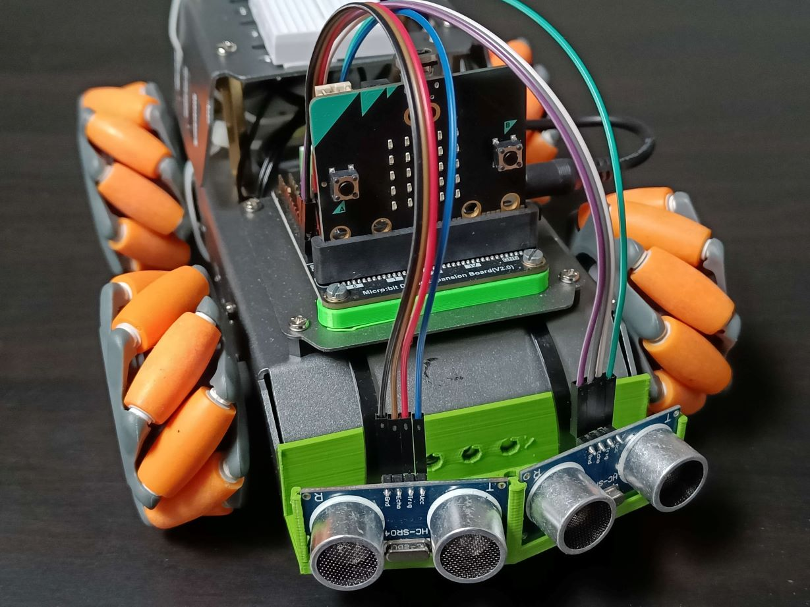
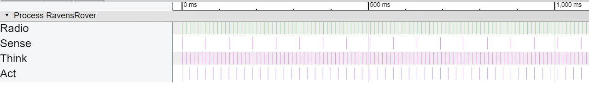

# RavensRover

<center>

<i>Our mecanum car build</i>
</center>

## Introduction

RavensRover is a group project within the Intelligent Real-Time Systems course at USN Kongsberg implementing a hard real-time system using Ada running on a Micro:bit v2.

Our project has two distinct modes of operation: radio controlled and autonomous.

## Modes of operation

The mode of the system is switched by pressing the A button, it will default to radio controlled when reset.

### Radio controlled

Using a seperate radio transmitter (Running on another Micro:bit v2) see `radiotransmitter/`, commands can be transmitted wireless to control the movement and speaker of the car.

The radio transmitter itself can control the movement by using the A and B buttons and the accelerometer. Holding both A and B will make the accelerometer control forward/backwards and rotation. Holding only A will make the robot strafe left with the accelerometer control still enabled. Same with B only strafing right instead.

Using scripts like `scripts/controller.py` for gamepad control and `scripts/play.py` for transmitting midi notes the transmitter is controlled by a computer over Serial/UART.

The car will automatically stop moving after 100ms since last radio move command was received, see `src/tasks/tasks-radio.adb` for implementation.

### Autonomous

In autonomous operation the car will move forwards and dodge obstacles using its sensors. Should a sensor fail, from reasons like being blocked the car will stop. See `src/tasks/tasks-think.adb` for implementation.

## Profiling

The project has conditional preprocessor-based profiling for all tasks using the `-gnateDPROFILING` compiler switch in `RavensRover.gpr`, setting it to true will make start and duration of all tasks get printed to the serial output.

This can be combined with the `scripts/profiler.py` script to generate traces compatible with the Google trace-viewer.

<center>

<i>The first second of operation visualised</i>
</center>

## Hardware setup
### DFR0548 motor driver
Connected to all motors and functions as breakout board. With the following motor mapping:
- M1: Left-back
- M2: Left-front
- M3: Right-back
- M4: Right-front

### Dual HC-SR04 ultrasonic sensors
Mounted in front using our custom [RoverMount](https://github.com/Bernoulli-IRTS/RoverMount) the sensors are connected to the following pins in addition to the 5V VIN and GND.
- Front right: Echo=P0, Trigger=P2
- Front left: Echo=P1, Trigger=P13

## Project setup
NOTE: On Windows longpaths in git may need to be enabled `git config --system core.longpaths true` and enabling [Win32 longpaths](https://www.thewindowsclub.com/how-to-enable-or-disable-win32-long-paths-in-windows-11-10).

Fetch thirdparty dependencies through git submodules
```shell
git submodule update --init --recursive
```
Open the RavensRover.gpr file using GNAT Studio and code

## Flashing

> [!WARNING]
> Note: After having flashed anything other than Ada, especially if it contains the nRF Softdevice do a mass erase, otherwise things wont run as expected!
> `pyocd erase --mass --t nrf52833`

After building either do `pyocd load -t nrf52833 --format elf obj/main` or launch through VSCode by pressing F5 and get a debugger, or through build/flash using GNAT Studio

## VSCode

Guide to set up Ada in VSCode:
- Install the recommended extensions for the workspace
- At the moment `microbit_v2_full.gpr` sets some variables that causes the AdaCore language server to fail, it can easily be fixed by commenting out two lines:
    - Go to `thirdparty/Ada_Drivers_Library/boards/MicroBit_v2/microbit_v2_full.gpr`
    - Comment out `for Target use "arm-eabi";` and `for Runtime ("Ada") use "ravenscar-full-nrf52833";` by adding `--` in front. It should be around line 60.
- Re-open VSCode, Ada should now work with the Ada Language Server by AdaCore :magic_wand:
